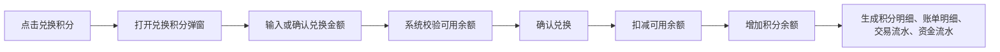
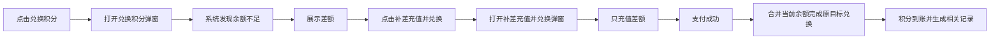
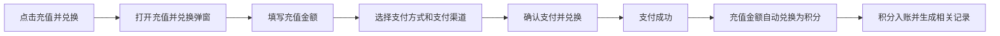

# 天合资金中心｜积分中心 PRD

| 版本 | 日期 | 说明 | 作者 |
|---|---|---|---|
| v1.0 | 2026-06-04 | 从资金中心 PRD 拆分积分中心独立需求说明 | Codex |

## 1. 页面定位

积分中心是资金中心下的用户端页面，用于查看当前账户口径下的积分资产、发起积分兑换、充值并兑换积分、查询积分明细，并追溯 AIGC token 消费记录。

积分归属于统一账户体系，但不等同于现金余额。积分可用于天合 AIGC 平台 token 消费，不支持提现。积分兑换成功后不支持退现金；AIGC 任务失败时仅回补积分，不退回现金余额。

对应原型：`finance-center-prototype/points.html`

## 2. 用户与账户口径

| 对象 | 说明 |
|---|---|
| 个人账户 | 查看个人积分余额、个人余额兑换积分、个人 AIGC token 消费记录 |
| 团队账户 | 查看团队积分余额、团队余额兑换积分、团队 AIGC token 消费记录 |
| 团队负责人 / 财务负责人 | 可在团队账户下发起团队积分兑换或充值并兑换 |
| 普通团队成员 | 是否可发起团队积分兑换需按团队权限控制；默认只允许查看授权范围内记录 |

账户切换规则：

| 场景 | 规则 |
|---|---|
| 当前为个人账户 | 页面展示个人积分账户、个人积分明细、个人 AIGC 消费记录 |
| 当前为团队账户 | 页面展示当前团队积分账户、团队积分明细、团队 AIGC 消费记录 |
| 切换团队 | 页面指标、列表、弹窗内到账账户和可用余额随团队切换更新 |

## 3. 页面入口

| 入口 | 说明 |
|---|---|
| 资金中心左侧菜单「积分中心」 | 进入积分中心页面 |
| 账户总览「积分余额」 | 从账户资金科目进入积分中心 |
| 积分中心「兑换积分」 | 打开余额兑换积分弹窗 |
| 积分中心「充值并兑换」 | 打开充值并兑换积分弹窗 |
| AIGC 平台消费记录 | 从 AIGC 消费场景追溯积分扣减记录 |

## 4. 页面结构

页面结构按用户阅读顺序组织：

1. 页面头部：说明积分是统一账户下的虚拟权益资产，提供「兑换积分」「充值并兑换」两个主操作。
2. 说明框：说明积分用途、兑换后不退现金、AIGC 失败仅回补积分。
3. 指标区：展示积分账户、本月获得、本月消耗、预计可用 token、处理中积分。
4. 查询区：按积分动作、关联业务单号、变动方向、账户类型、状态、发生时间范围查询。
5. 积分明细列表：展示积分获得、消耗、退回等记录。
6. AIGC token 消费记录：展示积分消耗到具体模型任务的记录。
7. 兑换积分弹窗：使用当前账户可用余额兑换积分。
8. 充值并兑换弹窗：在当前弹窗内完成充值、支付渠道选择和兑换确认。

不在页面主体中重复展示兑换规则卡片；必要规则放在顶部说明框和弹窗上下文中。

## 5. 指标区字段

| 字段 | 说明 |
|---|---|
| 积分账户 | 当前个人或团队积分账户名称 |
| 当前积分余额 | 当前账户可用积分余额 |
| 本月获得积分 | 本月通过兑换、奖励、退回等方式获得的积分 |
| 本月消耗积分 | 本月 AIGC token 消费扣减的积分 |
| 预计可用 token | 按当前积分余额估算可使用的 token 数量 |
| 处理中积分 | 处理中兑换、退回或消费记录涉及的积分 |

## 6. 核心业务规则

| 规则 | 说明 |
|---|---|
| 余额兑换积分 | 用户可直接使用当前账户可用余额兑换积分 |
| 充值并兑换积分 | 用户无需跳转充值中心，可在积分中心弹窗内完成充值和兑换 |
| 顶部入口充值并兑换 | 从顶部「充值并兑换」进入时，充值多少兑换多少 |
| 余额不足补差 | 从「兑换积分」弹窗进入补差时，只充值差额，支付后合并当前余额完成原目标兑换 |
| 积分兑换比例 | 当前原型口径为 `¥1 = 10 积分` |
| 积分现金退款 | 不支持。积分兑换成功后不可申请退现金 |
| AIGC 消费失败 | 仅回补积分，不退回现金余额 |
| 流水联动 | 积分兑换和 AIGC 消费需关联交易流水、资金流水、账单明细和积分明细 |
| 发票口径 | 积分充值 / 兑换是否开票暂不纳入一期，后续由财务税务确认 |

## 7. 兑换积分流程

### 7.1 余额充足

页面表现：

| 项 | 表现 |
|---|---|
| 当前可用余额 | 展示当前账户可用余额 |
| 本次兑换金额 | 展示本次准备兑换的现金金额 |
| 预计到账积分 | 按兑换比例计算 |
| 按钮 | 展示「确认兑换」 |

### 7.2 余额不足补差

补差示例：

| 字段 | 示例 |
|---|---|
| 当前可用余额 | `¥624,300` |
| 原目标兑换金额 | `¥800,000` |
| 需补差金额 | `¥175,700` |
| 支付后兑换金额 | `¥800,000` |
| 预计到账积分 | `8,000,000 分` |

补差弹窗规则：

| 项 | 规则 |
|---|---|
| 本次充值金额 | 等于差额 |
| 支付后兑换金额 | 等于原目标兑换金额 |
| 预计到账积分 | 按原目标兑换金额计算 |
| 快捷充值金额 | 补差模式下隐藏，避免用户误改补差金额 |

## 8. 充值并兑换流程

从页面顶部「充值并兑换」进入时，不依赖当前余额是否不足。该入口用于用户主动充值并兑换积分。

默认表现：

| 字段 | 说明 |
|---|---|
| 本次充值金额 | 用户本次支付金额 |
| 支付后兑换金额 | 与本次充值金额一致 |
| 预计到账积分 | 按充值金额和兑换比例计算 |
| 支付方式 | 当前一期展示在线支付 |
| 支付渠道 | 支付宝 / 微信 |

## 9. AIGC token 消费规则

| 场景 | 规则 |
|---|---|
| AIGC 任务成功 | 按任务消耗 token 扣减积分 |
| AIGC 任务失败 | 生成失败退回记录，回补对应积分 |
| 模型超时 | 视为失败退回，回补积分 |
| 余额不足 | AIGC 平台应提示积分不足，引导回积分中心兑换或充值并兑换 |
| 消费追溯 | AIGC 消费记录需关联消费单号、任务名称、token 消耗和积分消耗 |

## 10. 查询条件

| 条件 | 说明 |
|---|---|
| 积分动作 | 全部动作 / 余额兑换积分 / AIGC token 消费 / 消费失败退回 / 承接奖励积分 |
| 关联业务单号 | 支持 PT / AI / RC 等单号查询 |
| 变动方向 | 全部方向 / 获得 / 消耗 / 退回 |
| 账户类型 | 当前账户口径，支持个人账户 / 团队账户 |
| 状态 | 全部状态 / 成功 / 处理中 / 失败 / 已退回 |
| 发生时间范围 | 默认最近 30 天或当月，具体默认值跟随资金中心统一口径 |

## 11. 积分明细列表

默认字段：

| 字段 | 说明 |
|---|---|
| 积分流水号 | 平台内部积分明细编号 |
| 积分动作 | 余额兑换积分 / AIGC token 消费 / 消费失败退回 / 承接奖励积分 |
| 变动方向 | 获得 / 消耗 / 退回 |
| 积分变动 | 本次积分增减数量 |
| 关联金额 | 兑换积分时对应现金金额 |
| 关联 token | AIGC 消费时对应 token 数量 |
| 关联业务单号 | PT / AI / RC 等业务单号 |
| 状态 | 成功 / 处理中 / 失败 / 已退回 |
| 发生时间 | 积分动作发生时间 |

## 12. AIGC token 消费记录

默认字段：

| 字段 | 说明 |
|---|---|
| 消费单号 | AIGC 消费业务单号 |
| 应用 / 场景 | 智能分镜生成、文案扩写、提示词生成等 |
| 平台 | 天合 AIGC 平台或 AIGC 创作台 |
| token 消耗 | 本次任务消耗 token 数 |
| 积分消耗 | 本次任务扣减积分数 |
| 关联任务 | 用户可理解的任务名称 |
| 状态 | 成功 / 失败 / 已退回 |
| 发生时间 | token 消费发生时间 |

## 13. 关联单号规则

| 单号类型 | 前缀 | 说明 |
|---|---|---|
| 积分兑换单 | PT | 余额兑换积分、充值并兑换积分对应的兑换业务单 |
| AIGC 消费单 | AI | AIGC token 消费任务单 |
| 充值单 | RC | 充值并兑换中产生的充值单 |
| 交易流水号 | TX / FL | 平台交易事件记录，具体前缀以交易流水系统为准 |
| 资金流水号 | FF | 账户资金科目变动记录 |
| 积分流水号 | PF | 积分获得、消耗、退回明细 |

## 14. 弹窗字段

### 14.1 兑换积分弹窗

| 字段 | 说明 |
|---|---|
| 积分账户 | 当前个人或团队积分账户 |
| 积分账户 ID | 当前积分账户唯一标识 |
| 当前积分余额 | 当前积分余额 |
| 当前可用余额 | 可用于兑换积分的现金余额 |
| 本次兑换金额 | 用户准备兑换的现金金额 |
| 预计到账积分 | 按兑换比例计算 |
| 兑换比例 | 当前展示 `¥1 = 10 积分` |
| 兑换说明 | 用户填写或系统默认说明 |

### 14.2 充值并兑换弹窗

| 字段 | 说明 |
|---|---|
| 当前账户 | 当前个人或团队账户 |
| 当前可用余额 | 当前现金可用余额 |
| 本次充值金额 | 本次实际支付金额 |
| 支付后兑换金额 | 本次兑换积分的现金口径 |
| 预计到账积分 | 按支付后兑换金额计算 |
| 支付方式 | 当前一期为在线支付 |
| 支付渠道 | 支付宝 / 微信 |
| 兑换说明 | 用户填写或系统默认说明 |

## 15. 状态枚举

| 状态 | 说明 |
|---|---|
| 成功 | 积分获得、消耗或退回已完成 |
| 处理中 | 充值、兑换或退回处理中 |
| 失败 | 充值、兑换或消费失败 |
| 已退回 | AIGC 失败后积分已回补 |

## 16. 异常与边界

| 场景 | 处理 |
|---|---|
| 余额不足 | 展示差额和「补差充值并兑换」按钮 |
| 补差支付失败 | 保持原积分余额不变，展示失败状态，可重新支付 |
| 兑换失败 | 不扣减现金余额，不增加积分，展示失败原因 |
| 积分到账延迟 | 展示处理中状态，并允许用户查看记录或联系客服 |
| AIGC 消费失败 | 仅回补积分，不退现金 |
| 用户申请退现金 | 积分兑换成功后不支持退现金，页面不展示现金退款入口 |
| 无积分记录 | 列表展示空态「暂无积分记录」 |
| 查询无结果 | 展示「无匹配记录，请调整筛选条件」 |
| 无权限查看团队积分 | 隐藏团队数据或提示无权限 |

## 17. 权限规则

| 操作 | 个人账户 | 团队账户 |
|---|---|---|
| 查看积分余额 | 本人可见 | 授权团队成员可见 |
| 查看积分明细 | 本人可见 | 授权团队成员可见 |
| 兑换积分 | 本人可操作 | 团队负责人 / 财务负责人可操作 |
| 充值并兑换 | 本人可操作 | 团队负责人 / 财务负责人可操作 |
| 查看 AIGC 消费记录 | 本人可见 | 授权团队成员可见 |

## 18. 数据联动

积分中心需要与以下模块打通：

| 模块 | 联动说明 |
|---|---|
| 账户总览 | 展示积分余额入口，账户切换后同步积分数据 |
| 充值中心 | 充值并兑换产生充值单和支付状态 |
| 交易流水 | 记录充值、兑换、AIGC 消费等交易事件 |
| 资金流水 | 记录现金余额扣减或充值入账 |
| 账单明细 | 面向用户展示积分兑换相关现金支出 |
| AIGC 平台 | 接收 token 消费结果和失败退回结果 |

## 19. 埋点建议

| 事件 | 触发时机 |
|---|---|
| `points_page_view` | 进入积分中心 |
| `points_exchange_open` | 打开兑换积分弹窗 |
| `points_exchange_submit` | 提交余额兑换积分 |
| `points_shortage_recharge_open` | 余额不足后打开补差充值并兑换弹窗 |
| `points_recharge_exchange_open` | 从顶部入口打开充值并兑换弹窗 |
| `points_recharge_exchange_submit` | 提交确认支付并兑换 |
| `points_filter_submit` | 查询积分明细 |
| `aigc_token_record_view` | 查看 AIGC token 消费记录 |

## 20. 验收标准

| 场景 | 验收标准 |
|---|---|
| 进入积分中心 | 展示当前账户口径下积分指标、积分明细和 AIGC 消费记录 |
| 切换账户 | 页面指标、列表、弹窗账户信息同步切换 |
| 点击兑换积分 | 打开兑换积分弹窗，展示当前余额、兑换金额、预计到账积分 |
| 余额不足 | 兑换弹窗展示差额，并提供「补差充值并兑换」 |
| 补差充值并兑换 | 弹窗展示本次充值金额为差额，支付后兑换金额为原目标兑换金额 |
| 直接充值并兑换 | 弹窗展示充值金额、支付后兑换金额、预计到账积分一致 |
| AIGC 消费失败 | 积分明细展示「消费失败退回」，不出现现金退款入口 |
| 查询积分明细 | 可按动作、方向、状态、业务单号和时间筛选 |
| 无数据 | 展示清晰空态，不展示错误表格 |

## 21. 暂不纳入一期

- 积分是否可开票及开票口径。
- 积分赠送、积分过期、积分冻结。
- 积分转赠或团队间转移。
- 积分退款到现金。
- 真实支付收银台和支付渠道回调实现。
