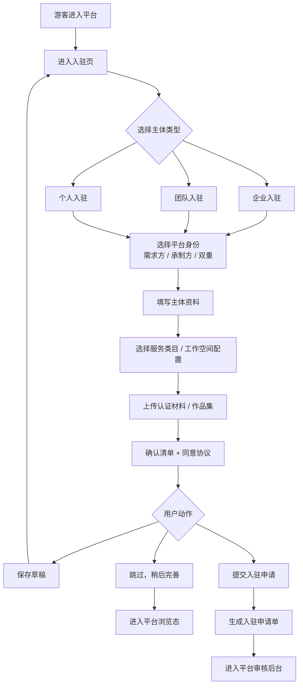
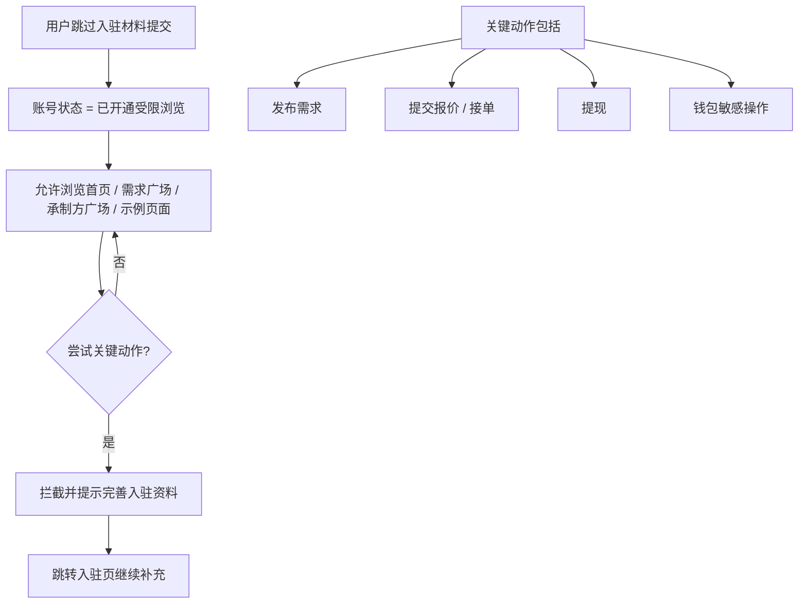
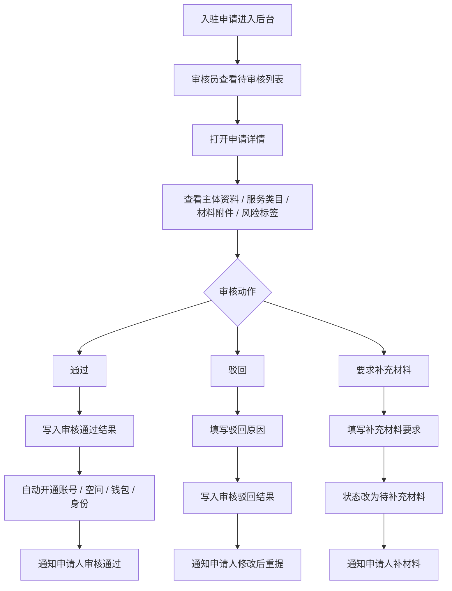
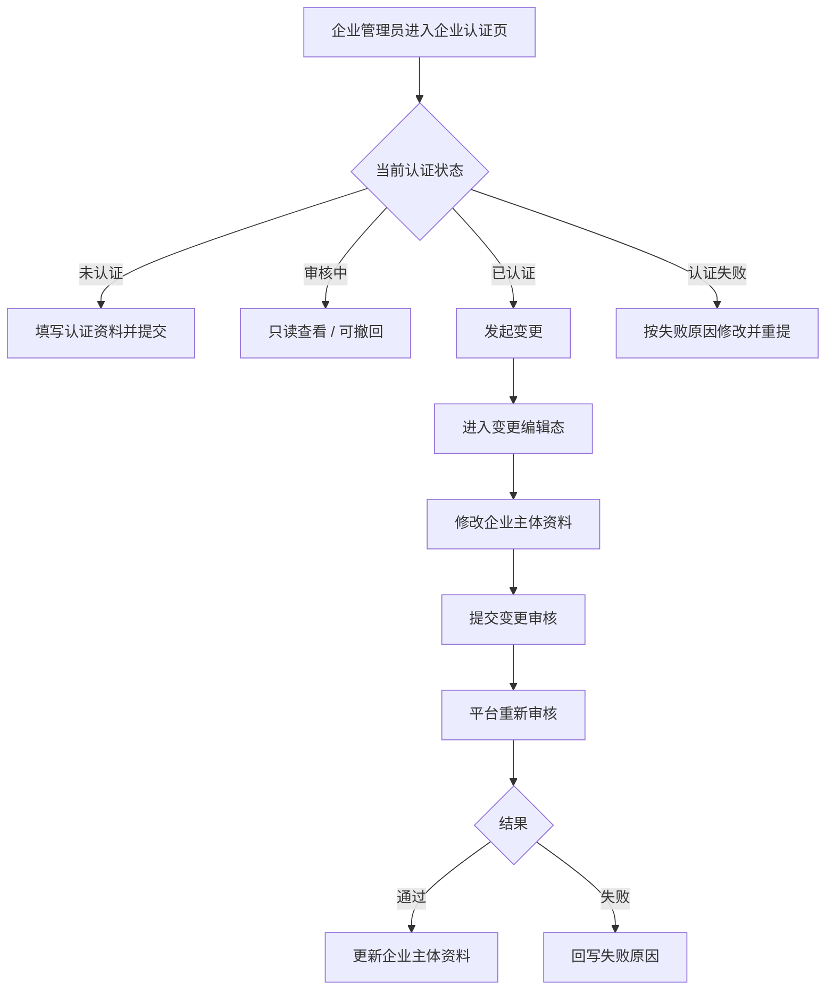
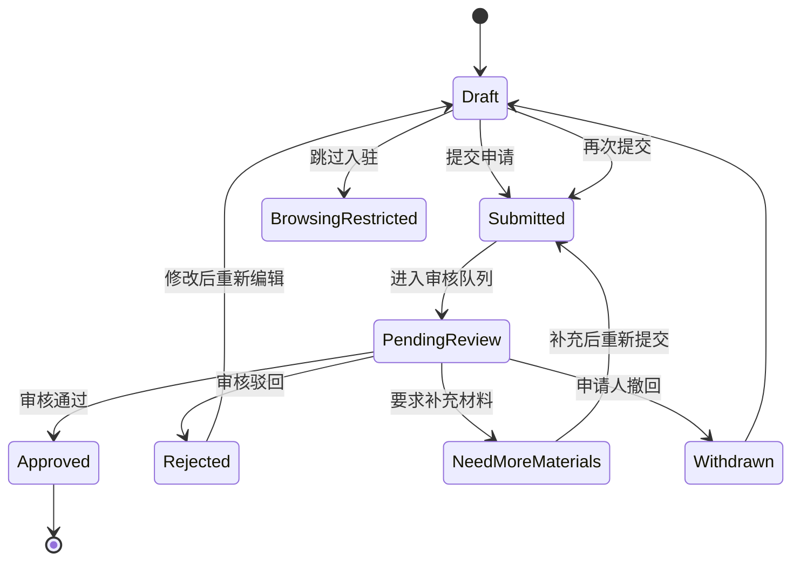
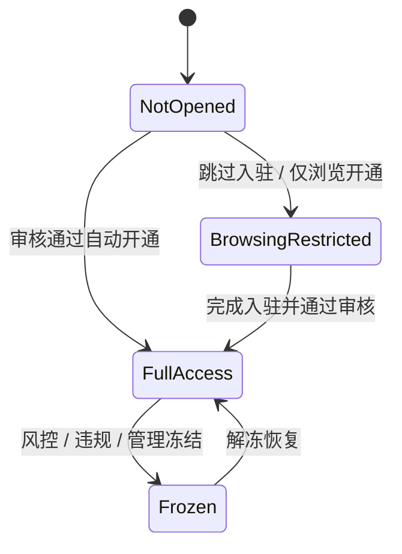
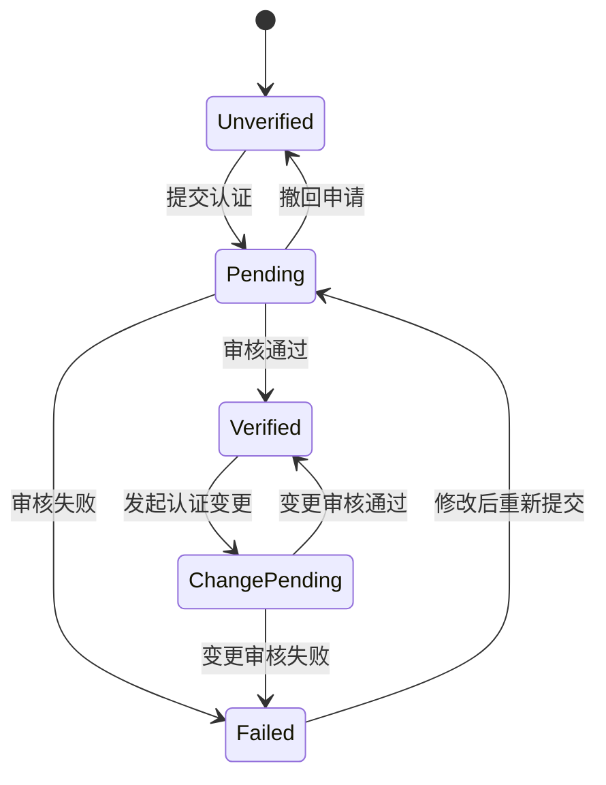

# 接单平台 1.3｜入驻与认证 - 页面流程图 + 审核状态机 + 字段清单

## 1. 页面流程图

### 1.1 游客到入驻申请主流程

### 1.2 跳过后受限浏览流程

### 1.3 平台审核后台流程

### 1.4 企业认证变更流程

## 2. 审核状态机

### 2.1 入驻申请状态机

### 2.2 账号准入状态机

### 2.3 企业认证状态机

### 2.4 审核动作与系统副作用

| 审核动作 | 申请状态变化 | 账号状态变化 | 系统副作用 |
|---|---|---|---|
| 通过 | `pending_review -> approved` | `not_opened / browsing_restricted -> full_access` | 开通账号、工作空间、钱包、平台身份 |
| 驳回 | `pending_review -> rejected` | 不变 | 记录驳回原因，通知申请人 |
| 要求补充材料 | `pending_review -> need_more_materials` | 不变 | 记录补充项，保留申请上下文 |
| 撤回 | `pending_review -> withdrawn` | 不变 | 终止当前审核，允许重新编辑 |

## 3. 字段清单

### 3.1 入驻申请主表 `onboarding_application`

| 字段 | 类型 | 必填 | 示例 | 说明 |
|---|---|---:|---|---|
| `application_id` | string | 是 | `ONB-20260426001` | 入驻申请唯一 ID |
| `subject_type` | enum | 是 | `enterprise` | 主体类型：`enterprise/team/personal` |
| `platform_identity` | enum | 是 | `dual` | 平台身份：`demander/contractor/dual` |
| `status` | enum | 是 | `pending_review` | 申请状态 |
| `subject_name` | string | 是 | `骋风天合文化传媒有限公司` | 主体名称 |
| `contact_name` | string | 是 | `昭岚` | 联系人/负责人 |
| `phone` | string | 是 | `13800001234` | 主要联系电话 |
| `email` | string | 否 | `zhaolan@cf.com` | 联系邮箱 |
| `intro` | text | 否 | `专注短剧与IP孵化...` | 主体简介 |
| `workspace_count_requested` | int | 否 | `3` | 申请开通的空间数量 |
| `biz_categories` | json/array | 否 | `["视频制作","图片设计"]` | 服务类目 |
| `profile_complete` | boolean | 是 | `true` | 是否已完成入驻资料 |
| `submit_time` | datetime | 否 | `2026-04-26 10:30:00` | 提交时间 |
| `reviewer_id` | string | 否 | `U-OPS-001` | 审核人 |
| `review_time` | datetime | 否 | `2026-04-27 14:00:00` | 审核时间 |
| `reject_reason` | text | 否 | `材料不完整` | 驳回原因 |
| `supplement_request` | text | 否 | `请补充作品集` | 补充材料要求 |
| `source_channel` | string | 否 | `web` | 申请来源 |

### 3.2 企业主体资料表 `enterprise_profile`

| 字段 | 类型 | 必填 | 示例 | 说明 |
|---|---|---:|---|---|
| `enterprise_id` | string | 是 | `ENT-001` | 企业主体 ID |
| `application_id` | string | 是 | `ONB-20260426001` | 关联入驻申请 |
| `enterprise_name` | string | 是 | `骋风天合文化传媒有限公司` | 企业全称 |
| `credit_code` | string | 是 | `91110105MA0XXXXX9X` | 统一社会信用代码 |
| `legal_person_name` | string | 是 | `周总` | 法定代表人 |
| `registered_address` | string | 否 | `北京市朝阳区...` | 注册地址 |
| `admin_name` | string | 是 | `昭岚` | 企业管理员姓名 |
| `admin_phone` | string | 是 | `13800001234` | 企业管理员手机号 |
| `admin_email` | string | 否 | `zhaolan@cf.com` | 企业管理员邮箱 |
| `cert_status` | enum | 是 | `verified` | 企业认证状态 |
| `cert_version` | int | 是 | `1` | 认证资料版本 |
| `change_reason` | text | 否 | `法人变更` | 最近一次变更原因 |

### 3.3 团队主体资料表 `team_profile`

| 字段 | 类型 | 必填 | 示例 | 说明 |
|---|---|---:|---|---|
| `team_id` | string | 是 | `TEAM-001` | 团队主体 ID |
| `application_id` | string | 是 | `ONB-20260425002` | 关联入驻申请 |
| `team_name` | string | 是 | `星辰创作工作室` | 团队名称 |
| `leader_name` | string | 是 | `陈星辰` | 团队负责人 |
| `leader_id_no` | string | 是 | `110105********1234` | 负责人身份证号 |
| `leader_phone` | string | 是 | `13900002345` | 联系电话 |
| `leader_email` | string | 否 | `star@team.com` | 联系邮箱 |
| `team_intro` | text | 否 | `擅长短视频、海报设计...` | 团队简介 |
| `workspace_count` | int | 是 | `1` | 默认 1 个团队空间 |

### 3.4 个人主体资料表 `personal_profile`

| 字段 | 类型 | 必填 | 示例 | 说明 |
|---|---|---:|---|---|
| `person_id` | string | 是 | `PSN-001` | 个人主体 ID |
| `application_id` | string | 是 | `ONB-20260424003` | 关联入驻申请 |
| `real_name` | string | 是 | `林小雅` | 真实姓名 |
| `id_no` | string | 是 | `110105********1234` | 身份证号 |
| `phone` | string | 是 | `13600007890` | 手机号 |
| `email` | string | 否 | `xiaoya@qq.com` | 邮箱 |
| `personal_intro` | text | 否 | `自由插画师...` | 个人简介 |
| `workspace_count` | int | 是 | `1` | 默认 1 个个人空间 |

### 3.5 平台身份开通表 `identity_enablement`

| 字段 | 类型 | 必填 | 示例 | 说明 |
|---|---|---:|---|---|
| `enablement_id` | string | 是 | `IDN-001` | 开通记录 ID |
| `application_id` | string | 是 | `ONB-20260426001` | 关联申请 |
| `user_id` | string | 是 | `U-001` | 开通到的用户 |
| `identity_type` | enum | 是 | `contractor` | `demander/contractor` |
| `enabled` | boolean | 是 | `true` | 是否开通 |
| `enable_time` | datetime | 否 | `2026-04-27 14:00:00` | 开通时间 |

### 3.6 工作空间开通表 `workspace_provision`

| 字段 | 类型 | 必填 | 示例 | 说明 |
|---|---|---:|---|---|
| `workspace_id` | string | 是 | `cf-drama` | 工作空间 ID |
| `application_id` | string | 是 | `ONB-20260426001` | 来源申请 |
| `workspace_type` | enum | 是 | `team` | `personal/team/admin` |
| `workspace_name` | string | 是 | `骋风天合·短剧制作中心` | 空间名称 |
| `owner_subject_id` | string | 是 | `ENT-001` | 所属主体 |
| `status` | enum | 是 | `active` | 空间状态 |

### 3.7 钱包/账户开通表 `wallet_provision`

| 字段 | 类型 | 必填 | 示例 | 说明 |
|---|---|---:|---|---|
| `wallet_id` | string | 是 | `enterprise-main-cf` | 钱包/账户 ID |
| `application_id` | string | 是 | `ONB-20260426001` | 来源申请 |
| `wallet_type` | enum | 是 | `enterprise-main` | `personal/team/enterprise-main` |
| `owner_subject_id` | string | 是 | `ENT-001` | 所属主体 |
| `linked_workspace_id` | string | 否 | `cf-drama` | 绑定空间 |
| `status` | enum | 是 | `active` | 账户状态 |

### 3.8 材料附件表 `onboarding_attachment`

| 字段 | 类型 | 必填 | 示例 | 说明 |
|---|---|---:|---|---|
| `attachment_id` | string | 是 | `ATT-001` | 附件 ID |
| `application_id` | string | 是 | `ONB-20260426001` | 关联申请 |
| `subject_type` | enum | 是 | `enterprise` | 主体类型 |
| `attachment_type` | enum | 是 | `business_license` | 附件类型 |
| `file_name` | string | 是 | `营业执照.pdf` | 文件名 |
| `file_url` | string | 是 | `/uploads/...` | 存储地址 |
| `file_mime` | string | 否 | `application/pdf` | 文件类型 |
| `file_size` | int | 否 | `3355443` | 文件大小（字节） |
| `ocr_status` | enum | 否 | `passed` | OCR/机器校验状态 |
| `review_note` | text | 否 | `清晰可辨` | 审核备注 |

### 3.9 企业认证变更记录表 `enterprise_cert_change`

| 字段 | 类型 | 必填 | 示例 | 说明 |
|---|---|---:|---|---|
| `change_id` | string | 是 | `ECC-001` | 变更单 ID |
| `enterprise_id` | string | 是 | `ENT-001` | 企业主体 |
| `from_version` | int | 是 | `1` | 变更前版本 |
| `to_version` | int | 是 | `2` | 变更后版本 |
| `change_fields` | json/array | 是 | `["legal_person_name","bank_account_no"]` | 变更字段 |
| `change_reason` | text | 否 | `法人和对公账户更新` | 变更原因 |
| `status` | enum | 是 | `pending` | 变更审核状态 |
| `submit_time` | datetime | 否 | `2026-05-02 11:00:00` | 提交时间 |
| `review_time` | datetime | 否 | `2026-05-06 16:00:00` | 审核时间 |

## 4. 审核原因与补充材料分类建议

### 4.1 驳回原因分类

| 编码 | 名称 | 说明 |
|---|---|---|
| `MATERIAL_INCOMPLETE` | 材料不完整 | 缺少必传文件 |
| `LICENSE_MISMATCH` | 营业执照信息不符 | 企业信息与填写内容不一致 |
| `IDCARD_BLUR` | 身份证模糊/缺失 | 证件不清晰或上传错误 |
| `PORTFOLIO_INVALID` | 作品集不符合要求 | 作品集不足以证明承制能力 |
| `SUSPECTED_FALSE_INFO` | 疑似虚假信息 | 人工发现风险 |
| `OTHER` | 其他 | 兜底项 |

### 4.2 补充材料分类

| 编码 | 名称 | 说明 |
|---|---|---|
| `SUPP_PORTFOLIO` | 补充作品集 | 针对承制方能力不足 |
| `SUPP_TEAM_AGREEMENT` | 补充团队协议 | 针对团队主体 |
| `SUPP_LICENSE` | 补充资质证书 | 针对特殊行业 |
| `SUPP_CONTACT_VERIFY` | 补充联系方式验证 | 手机/邮箱异常 |
| `SUPP_BANK_INFO` | 补充对公账户信息 | 企业认证变更时常用 |

## 5. 资源开通映射表

| 主体类型 | 身份类型 | 开通账号 | 开通空间 | 开通钱包 | 开通后台/工作台 |
|---|---|---|---|---|---|
| 企业 | 仅需求方 | 企业管理员账号 | 企业管理员视角 + 初始团队空间 | 企业主账户 + 团队预算账户（按配置） | 管理员后台 + 需求方工作台 |
| 企业 | 仅承制方 | 企业管理员账号 | 企业管理员视角 + 初始团队空间 | 企业主账户 | 管理员后台 + 承制方工作台 |
| 企业 | 双重身份 | 企业管理员账号 | 企业管理员视角 + 初始团队空间 | 企业主账户 + 团队预算账户（按配置） | 管理员后台 + 需求方/承制方双工作台 |
| 团队 | 仅需求方 | 团队负责人账号 | 1 个团队空间 | 团队账户 | 需求方工作台 |
| 团队 | 仅承制方 | 团队负责人账号 | 1 个团队空间 | 团队账户 | 承制方工作台 |
| 团队 | 双重身份 | 团队负责人账号 | 1 个团队空间 | 团队账户 | 需求方/承制方双工作台 |
| 个人 | 仅需求方 | 个人账号 | 1 个个人空间 | 个人账户 | 需求方工作台 |
| 个人 | 仅承制方 | 个人账号 | 1 个个人空间 | 个人账户 | 承制方工作台 |
| 个人 | 双重身份 | 个人账号 | 1 个个人空间 | 个人账户 | 需求方/承制方双工作台 |

## 6. 实施备注

* 如果后续要对接真实审核系统，建议先冻结本文件中的状态枚举和值对象命名，避免前后端口径漂移
* 企业入驻与企业认证强烈建议共用同一主体资料实体，否则后续“入驻通过但认证失败”之类场景会非常难收口
* “要求补充材料”建议视作独立状态，而不是直接驳回，这样更符合当前原型和实际审核作业习惯
